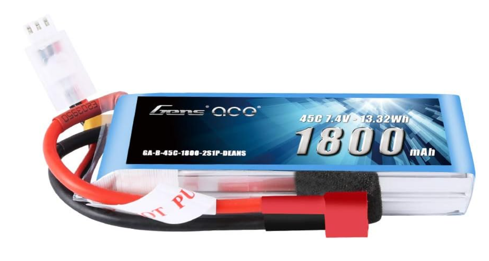
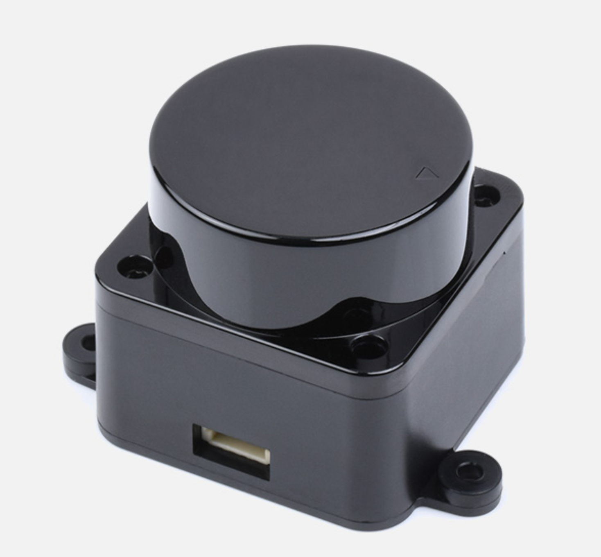
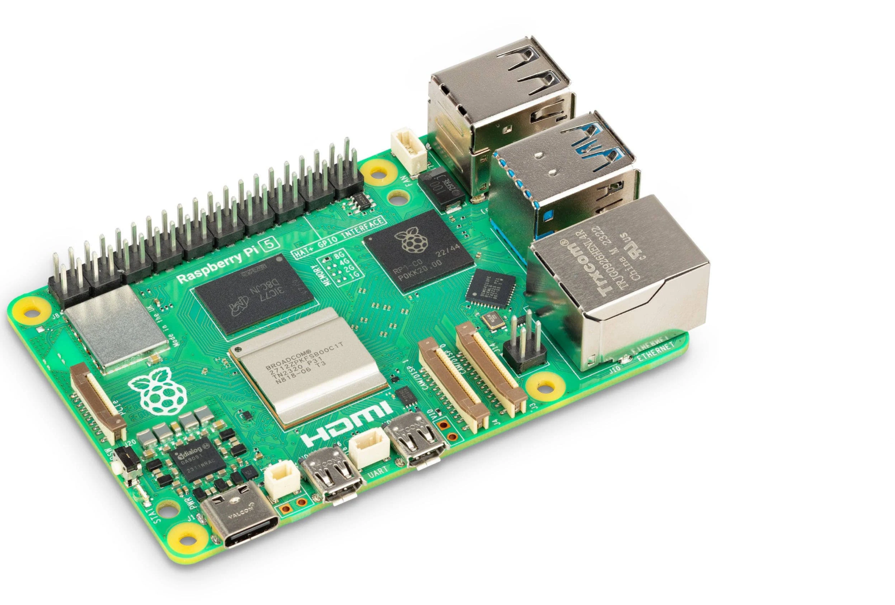
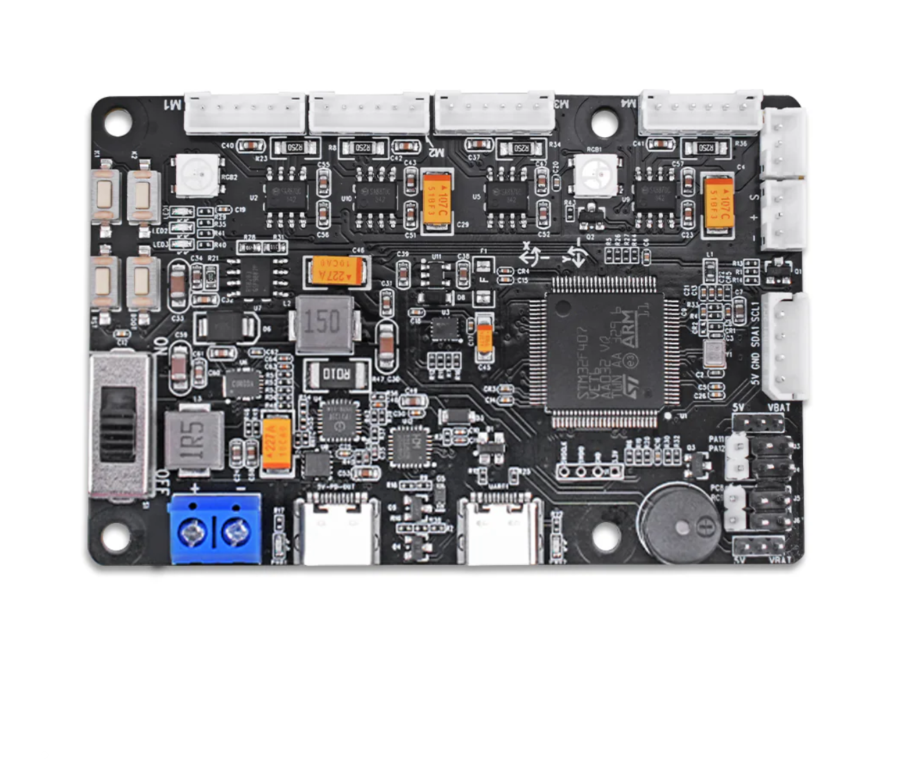
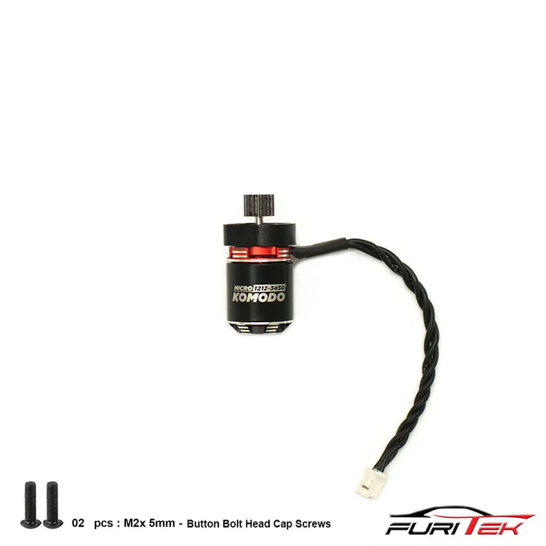
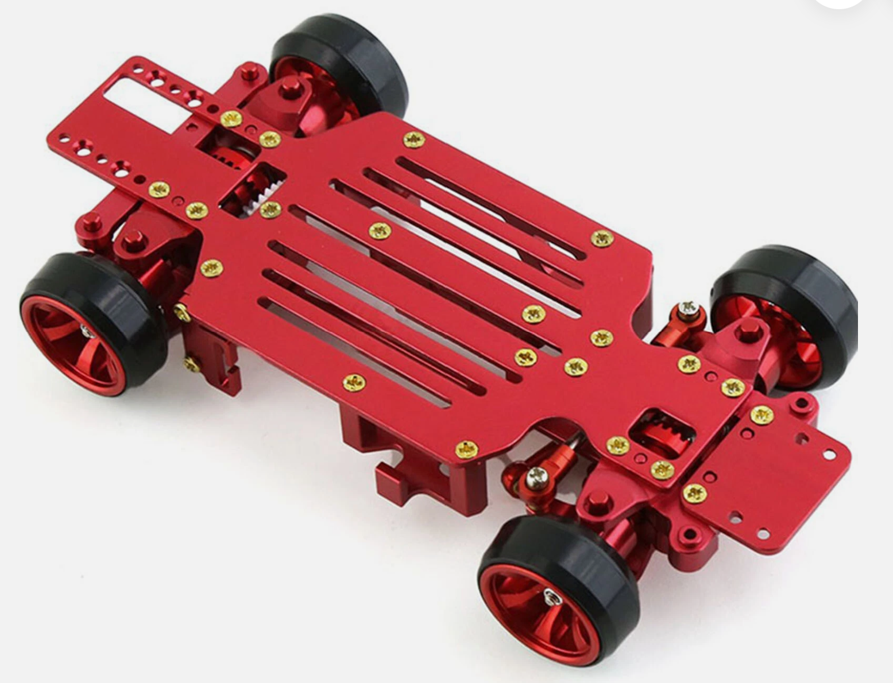

# WRO-FE-2025
Our repository for the 2025 World Robot Olympiad - Future Engineers.

Team Name: Team Cucumber

This repository contains information about our robot and the building process. 

## Links
- [Building Instructions](/Building-Instructions.md)
- [Software Documentation](/Software-Documentation.md)
- [Open Challenge Documentation](/Software-Documentation.md#open-challenge)
- [Obstacle Challenge Documentation](/Software-Documentation.md#obstacle-management)

## Table of Contents
* [The Team](#team)
* [The Challenge](#challenge)
* [The Robot](#robot-image)
  * [First Design](#first)
  * [Final Design](#final)
* [Performance Videos](#video)
  * [Open challenge](#OPCV)
  * [Obstacle Challenge](#OBCV)  
* [Management](#management)
  * [Mobility Management](#mobility-management)
      * [Motor](#motor)
      * [Servo Motor](#servo-motor)
      * [Wheels](#wheels)
  * [Power and Sense Management](#power-and-sense-management)
    * [Battery](#battery)
    * [Raspi Camera](#camera)
    * [LiDAR](#lidar)
    * [Raspberry Pi 5](#pi)
    * [Expansion Board](#expansion-board)
    * [Circuit Diagram](#circuit-diagram)
* [Total Cost](#cost-report)
* [Future Potential Improvements](#potential-improvements)

## Team Members 

### Lucas Zheng
**Age:** 14

**Introduction:**
Hello, I'm Lucas, and this is my first time competing in WRO. I'm from Canada and 14 years old. I'm interested in coding and mathematics. It is my first year of high school at Donald A. Wilson Secondary School. I was interested in WRO Future Engineers because it has hardware and software aspects.
### Walter Wu
**Age:** 14

**Introduction:**
Hi, my name is Walter and I'm from Canada, this is my second WRO season, two years ago I participated in WRO Robo mission and ended up on the international stage in Panama. This year since I was old enough for future engineers I decided to sign up for a completely different challenge, I am currently 14 years old and I have many interests from coding to a variety of video games and sports, I will be attending All saints catholic secondary school for their AMP program.
### Eric Huang
**Age:** 15

**Introduction:**
Hello, I'm Eric, and I have already participated in two WRO competitions so far. Although I have not entered the international stage in any of them, I believe these competitions helped me better problem solve and gave me something to do. This is also why I am participating in Future Engineers this year. My interests are chess, badminton, and swimming. 
## Our coach

### Rice Rao
<table>
  <tr>
    <td width="50%" style="text-align: left;">
       
    </td>
    <td width="50%" style="text-align: left; vertical-align: top;">
      <h3>Achievements:</h3>
      <ul>
        <li>Head coach of Robotics Competitions including FLL (First LEGO League) Tournament and WRO (World Robotics Olympiad). Led teams in winning multiple national, international robotics and programming awards.</li>
        <li>Over 20 years of IT industry experience as software engineer working internationally.</li>
        <li>MSc in Electrical & Computer Engineering from University of Alberta.</li>
        <li>BSc in Mathematics from Peking University.</li>
      </ul>
    </td>
  </tr>
</table>

## Group photo

## The Open Challenge 
The robot must complete three laps on the track after being placed randomly inside the walls of the track. The robot must have one button pressed to turn on the robot and one button pressed to run the program. After this, **no further interactions** with the robot are allowed.
## The Obstacle Challenge
The robot must complete three laps on the track with randomly arranged traffic signs which are green and red. The robot must go around the **right** side of a **red** pillar, and the **left** side of a **green** pillar. 

Learn about the challenges as well as the rules [here](https://wro-association.org/wp-content/uploads/WRO-2024-Future-Engineers-Self-Driving-Cars-General-Rules.pdf)

## Photos of Our Completed Robot: 

| *Front* | *Back* |
| :--: | :--: | 
|  |  | 
| *Left* | *Right* |
|  |  | 
| *Top* | *Bottom* |
|  |  | 

## Our videos       

### Our video of the open challenge on [Youtube](https://youtu.be/A2_c18GIqZw) 

 
### Our video of the obstacle challenge on [Youtube](https)   

## First design 
   

Above are some pictures of our first design for our robot. As you can see there are many flaws and as well as components missing. Although these designs not quite what we needed, they helped us find inspiration for our eventual final design. In fact, we decided to keep a lot of ideas from our earlier generations to incorporate into our robot. One of such is that we have the Raspberry Pi mounted on the back instead of the usual where it is found on top the chassis. Our servo was mounted using tape at first, but we realized that it wasn't secure enough. We switched to Velcro, but we realized that the servo motor still wiggled around a little. We switched to a type of Velcro that snaps in place, but it was still moving. We never had much problem securing our motor, using a piece of metal that came with the metal chassis to secure it. Finally, our 3d printed mount was not stable enough and the plastic was not thick enough. Another thing we tried in the first design were adding tire grips, these grips ended up being too high maintenance and couldn't properly do their job so we switched to finding better wheels.

## Final Design 

Our final design has many improvements and additions than the previous versions. Our robot includes sensors, those being the LiDAR and a camera, motors; being the servo and BLDC motors, a raspberry pi 5 and expansion board, as well as wheels and a battery. Our robot has been made to be compact so that we can be efficient with our limited space on the 1/28 scale chassis. We raised the baseplate to make space for the battery and the servo motor. To secure the servo motor, we used tape with Velcro, finding that this was better than just tape or just Velcro. We also added triangular supports to the mount so that it can hold the extra weight of the LiDAR. We made the plastic of the mount thicker as well to support the camera, Raspberry Pi, and the LiDAR. We changed the pin so that it was more stable and better connected the mount to the metal chassis.

 

## Challenges We Faced 
### Short Circuit
After we soldered the battery connector to the ESC and the extension board, we were ready to flip the switch. Unfortunately, we switched the positive and negative wires, resulting our extension board to be burned. This taught us to be more cautious before closing the circuit and helped us avoid similar situations along the way.
### Servo Motor
We realized that we could not fit the battery and the servo motor under our 3D printed plate. We decided to raise the 3D printed plate to make more space. 
A new problem came up. It was hard to fully secure the servo motor in place. 
### Processing Too Slow
We overcame the problem of our program running too slowly by switching to a combination of multiprocessing and threading. Initially, our single-threaded approach caused delays, especially when handling tasks like image processing, motor control, and sensor feedback all at once. To solve this, we implemented multiprocessing to separate heavy tasks, such as camera frame processing, into their own processes, allowing them to run in parallel without blocking the main loop. At the same time, we used threading for lighter background tasks like logging data or checking sensors continuously. This made our program significantly faster and more responsive, allowing our robot to perform in real time without lag or missed inputs.
### LiDAR Was Unreliable
At first, we used our mounted camera to follow walls. This worked out great for the open challenge and seemed to work well for our obstacle challenge at first, but we soon found some cases in which the robot would completely go the wrong way with our camera wall following and pillar detection. Take this case for example.
### Unreliable Orange Line Detection
We switched to orange line detection from blue line detection because it was more reliable. However, when we tested it in a different lighting environment, it would sometimes find too many orange lines (it would detect red pillars as orange lines), or it would detect too little orange lines. This is still a problem, so in new environments our first thing to do will be to adjust the LAB values for the orange line and the two colors of the pillars.

The robot sees this red pillar and tries to turn left, but as soon as it stops seeing it, the robot turns right. We thought using LiDAR for wall following would be a good solution since it can "see" very far. However, LiDAR was very unreliable, especially when the robot was in motion. This led to the robot wobbling around and sometimes just crashing into a wall. We went back to using our camera for wall following. 

# Management 

## Power and Sense Management 

Our power and sense management is made up of our battery, our camera, our LiDAR, Raspberry Pi 5, and our Hiwonder expansion board. The battery provides power to all of our components such as our motor, servo motor, camera, etc. We secured the battery using Velcro. It is placed right under the baseplate. We thought this spot would be best since it is near the center of the robot. Our camera is one of the most important parts of our robot. We use it for wall following and detecting the pillars. Our camera is mounted high so that the bottom of the robot does not get in its way. Our camera is then secured using electrical tape. We made sure that our camera had a large enough FOV so that it could see both walls. Our LiDAR was recently implemented. It is secured under the mount with double-sided tape. We use it for parking and detecting the parking walls. We decided to use the Raspberry Pi 5 as our microcontroller because it is stable and has a good amount of processing power. It is mounted with screws on the back of the mount. Finally, our expansion board provides us with more ports. All these components help the robot navigate the open and obstacle challenge. 

### Our battery 
<table>
  <tr>
    <td width="50%" style="text-align: left;">
       
    </td>
    <td width="50%" style="text-align: left; vertical-align: top;">
      <h3>Specifications:</h3>
      
Voltage(V): 7.4V

      
Capacity(mAh): 1800mAh

      
Discharge rate(C): 90C

      
Weight: 100g

    </td>
  </tr>
</table>

### Potential Improvements
- We could have bought a battery with higher density energy cells to extend the operating time while generally having the same weight. 
- We could have made a special compartment to mount the battery instead of it hanging on the bottom of the baseplate. This would reduce the stress on the robot and prevent the battery from falling down.

### Our Camera 
<table>
  <tr>
    <td width="50%" style="text-align: left;">
       
    </td>
    <td width="50%" style="text-align: left; vertical-align: top;">
      <h3>Specifications:</h3>
      
Sensor Size: 1/4-inch optical format (approx. 3.674 mm × 2.760 mm)

      
Sensor Resolution: 3280 × 2464 pixels

      
Pixel Size: 1.12 µm × 1.12 µm

      
Lens Mount Type: M12 (S mount)

      
Autofocus support: None

    </td>
  </tr>
</table>

### Potential Improvements
- We could have swapped the camera lens with a higher quality lens to increase detection of pillars and to prevent colors getting mixed up.
- We could have adjusted our fish-eye lens so that it does not warp the shape of some objects.
  
### Our LiDAR 
<table>
  <tr>
    <td width="50%" style="text-align: left;">
       
    </td>
    <td width="50%" style="text-align: left; vertical-align: top;">
      <h3>Specifications:</h3>
      
Typical measuring range: 0.03~12m

      
Scanning range:	360°

      
Sampling frequency:	5000 Hz

      
Scanning frequency:	10 Hz

      
Angular resolution:	≤0.72°

    </td>
  </tr>
</table>

### Potential Improvements
- We could have bought a LiDAR with a higher Hz/RPM so that it updates the scan faster.
- We could have bought a solid-state LiDAR. These have much higher frame rates and are more accurate. However, many of these are costly and they cannot see 360 degrees.
### Our Raspberry Pi 5 
<table>
  <tr>
    <td width="50%" style="text-align: left;">
       
    </td>
    <td width="50%" style="text-align: left; vertical-align: top;">
      <h3>Specifications:</h3>
      
Processor (SoC): Broadcom BCM2712

      
GPU: VideoCore VII

      
RAM: 16 GB LPDDR4X-4267 MHz

      
Storage: micro-SD (SDR104) + PCIe 2.0 x1 slot

      
Power supply: 5 V / 5 A via USB-C

    </td>
  </tr>
</table>

### Potential Improvements
Right now, the Raspberry Pi is mounted to the back piece with extra long screws and, for the future if we we're to try with this design again we would definitely like it to be closer as with the Raspberry Pi being farther out not only does it make our robot bigger, but as well it shifts the center of gravity and overall makes it harder to steer. With a combination of better wheels and a tighter place for the Raspberry Pi the robot could definitely perform better.
Another note to add for the future was that we should've definitely found more uses for the GPIO pins such as with an ultrasonic sensor.

### Our Expansion Board 
<table>
  <tr>
    <td width="50%" style="text-align: left;">
       
    </td>
    <td width="50%" style="text-align: left; vertical-align: top;">
      <h3>Specifications:</h3>
      
Main Control Chip: STM32F407VET6

      
PD Power Support: Raspberry Pi 5 protocol, up to 5 V / 5 A

      
IMU Sensor: 6-axis (gyro + accelerometer)

      
Connectivity: USB, I2C, sensor expansion, PWM/serial control

      
Motor Ports: 4-channel encoder motors with PID control

    </td>
  </tr>
</table>

### Potential Improvements
With our design as is, our expansion board is quite cluttered and the wires aren't properly managed very well. Next time we attempt something like this we would definitely aim to keep the wires short and make sure they aren't crossing into anything they shouldn't.
### Our circuit schematic [here](#diagram)

## Mobility Management 
Our mobility is made possible by a few different parts, these being the code that gets run through our raspberry pi and expansion board, the actual moving made possible through the BLDC motor and ESC, the steering which is controlled by our servo motor and can well, steer the front wheels, and our wheels. Firstly, our code is tuned so that the servo motor can steer precisely where we want it to, and so that the DC motor can move exactly as fast as we want it to. The next parts being our actual BLDC moto and ESC. The ESC is wired into our expansion board so that we can utilize PWM (pulse width modulation) to control how fast our BLDC motor is and our BLDC motor runs into a differential gear at the back of our car as we decided to use RWD instead of FWD or AWD because well, the servo is controlling the front wheels and AWD is banned. 
Next is our servo motor. Our servo motor is wired directly into the PWM pins on our expansion board and the servo arm is attached to our front wheels, the servo motor required a lot of fine tuning as the servo_straight variable was hard to decide. Lastly our wheels went through many variations before finally settling on the one we are using currently. Before as the tires were too small we would add tire grips to increase the circumference of the tires as well as the grip as sometimes they would slip, but those tire grips would often fall off decreasing the consistency of our robot, so after careful consideration we landed on the current version of wheels which worked really well during testing.

### Our BLDC Motor 
Our DC brushless motor drives the back wheels thanks to the differential gear which ensures that the car can drive straight. Our motor is secured using a metal part of the chassis that is secured with screws. We chose motor because it is small, reliable, and the gear ratio matched with the chassis gears.
<table>
  <tr>
    <td width="50%" style="text-align: left;">
       
    </td>
    <td width="50%" style="text-align: left; vertical-align: top;">
      <h3>Specifications:</h3>
      
Voltage: 10V

      
Gear Ratio: 1:2

      
Speed: 3450 rpm

      
Weight: 17.5g

    </td>
  </tr>
</table>

### Potential Improvements
Our BLDC motor is connected to a standard gear but, the gears we are using are made out of plastic and are easily broken, as this has happened if the past and it caused our robot to stutter or stop moving completely. We could've found an alternative to plastic gears such as a lightweight metal or even just a stronger plastic alternative as in nylon.

### Our Servo Motor 

<table>
  <tr>
    <td width="50%" style="text-align: left;">
       
    </td>
    <td width="50%" style="text-align: left; vertical-align: top;">
      <h3>Specifications:</h3>
      
Operating Voltage Range: 4.8V ~ 6.0V

      
Speed: 2.0 ~ 1.7

      
Maximum Torque Range kg. / cm.: 1.3 ~ 1.6

      
Weight: 9.5g

    </td>
  </tr>
</table>

### Potential Improvements
Our servo motor is slightly prone to moving from a lot of wear. This can offset the servo arm and make our steering slanted. In the future if we were to attempt the same thing we would 100% find a way to secure the servo in place such as, with super glue or zip ties.

### Our Wheels 
<table>
  <tr>
    <td width="50%" style="text-align: left;">
       
    </td>
    <td width="50%" style="text-align: left; vertical-align: top;">
      <h3>Specifications:</h3>
      
Diameter w/o tires: 20mm

      
Width w/o tires: 8mm

      
Weight: 16g

    </td>
  </tr>
</table>

### Potential Improvements
Our wheels are small and it causes our chassis to be lower to the ground causing it to occasionally brush against the mat, in more severe cases getting stuck. We could've browsed for bigger and more grippy wheels which would in turn solve this problem. 

### Circuit Diagram  

## Total Price of the Robot 
| Component  | Cost |
| ------------- | ------------- |
| Motor  | $110.51 |
| Servo Motor  | $24.99  |
| Camera  | $16.87  |
| Raspberry Pi 5  | $113.95  |
| 3D Printings  | $8  |
| Raspberry Pi Expansion Board   | $54.98  |
| Metal Chassis  | $86.38  |
| Battery  | $42.78  |
| Wires  | $26.75  |
| Wheels  | $9.13  |
| Switch  | $1.03  |
| Velcro and Tape  | $21.30  |
| LiDAR sensor  | $89.99  |
| Total Price Before Tax   | $606.66  |
| Total Price   | $685.53  |

## Potential Future Improvements 
We should have added an automatic color correction calibration, as our camera has some problem adapting to different environments. Sometimes we would have to manually fine-tune the color correction for different lighting environments. Sometimes our environments would be too dark, leading the robot to wrongly detect certain things such as missing some green or red pillars. We could calibrate the color correction by holding up the red and green pillars, and recording and automatically adjusting the CIELAB values. 

We could add a voltage regulator to see when our robot is at low battery. Many of the problems in our obstacle and open challenge is caused by low battery and the readings from our sensors are less reliable when we have low battery. With this voltage regulator, we could avoid spending too much time trying to fix problems when instead they could be fixed by using a battery with full power. 

## Sources
LiDAR - [here](https://www.waveshare.com/wiki/D500_LiDAR_Kit)

Battery - [here](https://www.amazon.ca/Gens-ace-Battery-Airplane-Helicopter/dp/B073RFHKWH)

Servo Motor - [here](https://hitecrcd.com/hs-5055mg-economy-metal-gear-feather-servo/)

BLDC Motor - [here](https://furitek.com/products/combo-of-furitek-lizard-pro-30a-50a-brushed-brushless-esc-for-axial-scx24-with-bluetooth)

Camera - [here](https://www.aliexpress.com/item/1005007274396582.html?spm=a2g0o.order_list.order_list_main.11.74af1802IJ8jJV#nav-specification)

Wheels - [here](https://www.aliexpress.com/item/1005004174366878.html?spm=a2g0o.detail.pcDetailBottomMoreOtherSeller.6.7e9bminTminTAI&gps-id=pcDetailBottomMoreOtherSeller&scm=1007.40196.394786.0&scm_id=1007.40196.394786.0&scm-url=1007.40196.394786.0&pvid=dbe58872-1796-4911-95bf-a4c5d060e85a&_t=gps-id:pcDetailBottomMoreOtherSeller,scm-url:1007.40196.394786.0,pvid:dbe58872-1796-4911-95bf-a4c5d060e85a,tpp_buckets:668%232846%238113%231998&pdp_ext_f=%7B%22order%22%3A%22162%22%2C%22eval%22%3A%221%22%2C%22sceneId%22%3A%2230050%22%7D&pdp_npi=4%40dis!CAD!5.81!5.81!!!28.73!28.73!%402101c59817427507077044104ec0d6!12000028283974218!rec!CA!!ABX&utparam-url=scene%3ApcDetailBottomMoreOtherSeller%7Cquery_from%3A)

Raspberry Pi 5 - [here](https://www.raspberrypi.com/products/raspberry-pi-5/)

Expansion Board - [here](https://www.hiwonder.com/products/rrc-lite)
